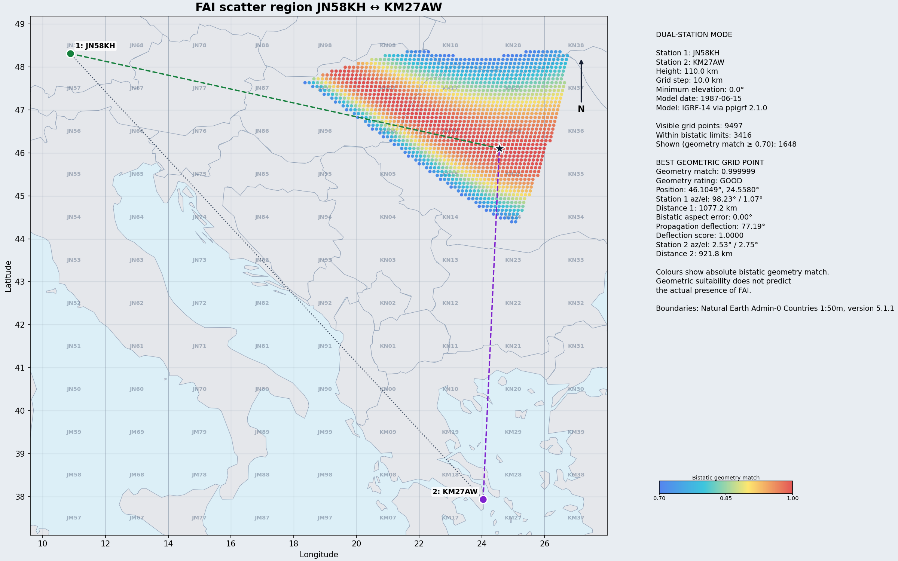

# FAI Geometry Explorer

FAI Geometry Explorer is an experimental tool for radio amateurs who want to
explore the geometry of mid-latitude Field Aligned Irregularity (FAI) scatter
at 144 MHz. It calculates where a theoretically suitable scatter region may
exist between two stations, the corresponding antenna directions, and how
closely the bistatic scattering vector is perpendicular to the local
geomagnetic field.

The purpose of the program is to provide geometric insight and to revisit
historical FAI observations. Its output is **not a propagation forecast**: a
high score means that the geometry is favourable, not that ionospheric
irregularities are actually present or that a contact will be possible.

## Background and scope

I have no practical experience with FAI propagation myself. This program
therefore does not represent personal operating expertise. It is a theoretical
implementation based on articles published in DUBUS in 1986 and 1987, when
there was considerable interest in mid-latitude FAI propagation at 144 MHz.

The main historical sources behind the model are:

- DUBUS 3/86 — Ludovico Scaroni, I3LDS, *Recent Acquisitions on Midlatitude
  F.A.I. Propagation at 144 MHz*;
- DUBUS 1/87 and 2/87 — Günter Köllner, DL4MEA, *FAI Informationen*;
- the historical Sharp program listing on page 68 of DUBUS 1/87.

The articles, reported contacts, and historical calculation methods have been
translated into a modern geometric model using WGS84 and IGRF-14. Where the
source material required interpretation, the resulting assumptions are
documented. This project should therefore be treated as research software: it
is useful for exploring hypotheses and antenna directions, but it is not a
validated propagation model.

## Example

The map below shows a Dual Station calculation between JN58KH and KM27AW. The
colours represent the absolute bistatic geometry match. Red indicates the most
favourable geometry; the map does not indicate the actual presence or strength
of FAI.



## Features

- **Sked Mode / Dual Station Mode** — explore the theoretically suitable
  scatter region between two known Maidenhead locators.
- **Explorer Mode / Single Station Mode** — search from one station for
  possible scatter points and reachable correspondent regions, optionally
  within a specified antenna sector.
- Calculation of azimuth, elevation, distance, scatter deflection, and aspect
  geometry.
- IGRF-14 geomagnetic field calculations for a selected date.
- Export to a shareable PNG or an interactive local HTML/SVG map.
- Both a graphical interface and a command-line interface.

## Installation

Python 3.12 or newer is required. Clone the repository and install the project
from its root directory:

```console
git clone https://github.com/pe1itr/fai-geometry-explorer.git
cd fai-geometry-explorer
python -m pip install -e .
```

The main Python dependencies are NumPy, pandas, Matplotlib, and `ppigrf` 2.1.0.

## Graphical interface

Start the GUI after installation with:

```console
fai-geometry-gui
```

It can also be started directly from a checkout:

```console
python -m fai_explorer.gui
```

Use **Sked Mode** for two known stations or **Explorer Mode** to search from a
single location and antenna direction. Scatter height, grid spacing, model
date, and output file can be configured through the Config menu.

## Windows application

A ready-to-use 64-bit Windows version is available from the repository's
**Releases** page. Download `FAI-Geometry-Explorer-Windows.zip`, extract it,
and double-click `FAI-Geometry-Explorer.exe`. Python and the required
dependencies are included; no installation is required.

The executable is not digitally code-signed, so Windows SmartScreen may show
an unknown-publisher warning when it is started for the first time.

### Creating a Windows release

Every push to `main` starts the **Build Windows application** workflow and
creates a temporary test artifact. Pushing a version tag additionally publishes
the ZIP as a GitHub Release:

```console
git tag v0.1.0
git push origin v0.1.0
```

The executable is built on GitHub's Windows runner and should not be committed
to the source repository.

### Building locally on Windows

To build the executable directly on Windows, install 64-bit Python 3.12, open
PowerShell in the project directory, and run:

```powershell
.\tools\build_windows.ps1
```

The executable will be written to `dist\FAI-Geometry-Explorer.exe`.

## Command line

Calculate the geometry between two stations:

```console
python -m fai_explorer \
  --locator1 JN58KH \
  --locator2 KM27AW \
  --grid-step-km 10 \
  --height-km 110 \
  --date 1987-06-15 \
  --output-map fai_scatter_map.png
```

Both stations are placed at the centre of their Maidenhead squares. Known
antenna heights can be supplied with `--altitude-a-m` and `--altitude-b-m`.
Using an output filename ending in `.html` creates an interactive map instead
of a PNG.

Search from a single station:

```console
python -m fai_explorer \
  --locator1 JO21QK \
  --azimuth 140 \
  --azimuth-tolerance 20 \
  --grid-step-km 10 \
  --height-km 110 \
  --output-map fai_single_JO21QK.png
```

Without `--azimuth`, all directions are examined. All available options are
listed by:

```console
python -m fai_explorer --help
```

## Interpreting the map and geometry match

The program tests visibility from both stations and ranks grid points by the
angle between the bistatic scattering vector and the local magnetic field.
Every PNG uses the same scale from 0 to 1 and, by default, displays only points
with a geometry match of at least 0.70.

A score close to 1 only means that a grid point closely satisfies the selected
geometric criterion. It says nothing about the formation, intensity, lifetime,
or probability of FAI. If no point reaches the threshold, no coloured scatter
region is drawn; the best grid point may still be reported as a weak research
indication.

## Weak-signal digital modes

The historical FAI contacts on which this project is based were made using CW
or SSB. Analysis of the available historical recordings found strong CW tone
cores approximately 22–32 Hz wide in the clearest signals. FT8 uses 6.25 Hz
tone spacing. Under conditions resembling these recordings, standard FT8 is
therefore unlikely to be a reliable mode.

A practical starting point for experiments is **Q65-15B**. It combines a short
15-second T/R period with approximately 12.8 seconds of transmission and 13.33
Hz tone spacing. If a signal is visible but too broad or rough to decode
reliably, try **Q65-15C** with 26.67 Hz spacing. For openings that remain stable
for longer, **Q65-30C** or **Q65-30D** may benefit from their longer integration
period.

These are experimental starting choices, not a guarantee of a decode. Actual
performance remains dependent on signal strength, fading, and instantaneous
Doppler spread. The measured tone widths are indicative and may also be
influenced by receiver filtering, oscillator stability, recording quality, and
the limited number of available historical recordings.

## Model assumptions and limitations

- The Earth is modelled using WGS84; coordinates are converted internally to
  ECEF.
- A Maidenhead locator represents the centre of its square.
- The distance of each scatter leg is the straight three-dimensional
  line-of-sight distance.
- Azimuth runs clockwise from geographic north; elevation is positive above
  the local geometric horizon.
- The geomagnetic field is calculated with IGRF-14 through `ppigrf`.
- The default scatter height is 110 km.
- Atmospheric refraction, terrain, antenna patterns, propagation losses, and
  the current state of the ionosphere are not modelled.

The simplified country boundaries used in the maps are derived from Natural
Earth Admin-0 Countries 1:50m, version 5.1.1.

## Contributing

Issues, practical experience, historical observations, and reviews of the
model assumptions are welcome. Feedback from radio amateurs with hands-on FAI
experience would be especially valuable in documenting the gap between
theoretical geometry and actual operating conditions.

## License

FAI Geometry Explorer is open-source software released under the
[MIT License](LICENSE).

Developed by Rob Hardenberg, PE1ITR.
